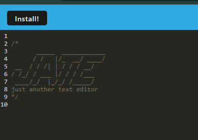

# NoteForge-Progressive-Text-Editor

## Description

This project is a Progressive Web Application (PWA) text editor that allows users to create, edit, and save notes or code snippets with or without an internet connection. It leverages IndexedDB for data persistence, ensuring reliable retrieval of content even in offline scenarios.

## Installation

To run this application locally, follow these steps:

1. Clone the repository to your local machine:

   ```bash
   git clone https://github.com/your-username/pwa-text-editor.git
   ```

2. Navigate to the project directory:

   ```bash
   cd pwa-text-editor
   ```

3. Install the dependencies:

   ```bash
   npm install
   ```

4. Start the development server:

   ```bash
   npm run start
   ```

5. Open your web browser and navigate to `http://localhost:3000` to view the application.

## Usage

- To create a new note or code snippet, simply start typing in the editor area.
- Your content will be automatically saved to IndexedDB when you click off the DOM window.
- If you close the application and reopen it, your content will be retrieved from IndexedDB.

## Technologies Used

- HTML5
- CSS3
- JavaScript (ES6+)
- IndexedDB
- Webpack
- Workbox (for service worker)
- Babel

## Demo



## Deployed Application

The application is deployed on Render and can be accessed [here](https://noteforge-progressive-text-editor.onrender.com).

## Credits

This project was created as a part of the [edX Boot Camp](https://bootcamp.edx.org/) curriculum.

## License

This project is licensed under the [MIT License](LICENSE).
